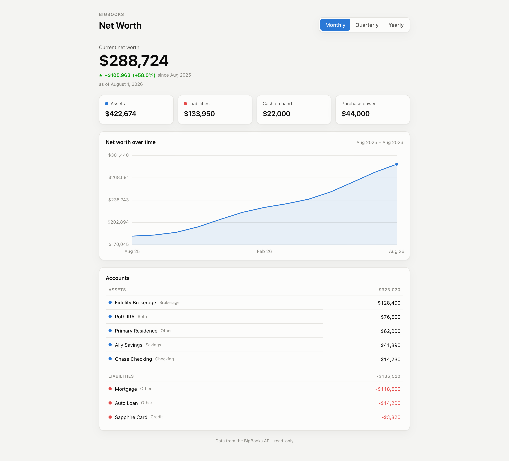

# BigBooks Net Worth Dashboard

A simple, **fully static** net worth dashboard built on the [BigBooks API](https://api.bigbooks.app).
No backend, no build step — just HTML, CSS, and vanilla JS. Authentication uses
**OAuth 2.0 Authorization Code + PKCE** entirely in the browser, so there is no
client secret to protect and nothing runs server-side.



<sup>Screenshot from `#demo` mode — synthetic figures, no account needed.</sup>

It shows:

- **Current net worth** with the change over the selected period
- **Assets, liabilities, cash on hand, and purchase power** tiles
- A **net worth trend chart** (Monthly / Quarterly / Yearly) with hover tooltips
- An **account breakdown** grouped into assets and liabilities
- **Link a bank/card/investment account via Plaid** — the "+ Link account" button
  (and the first-run empty state) opens Plaid Link and imports the accounts

## How it works

```
Browser (this static app)
  │  1. Authorization Code + PKCE  ──►  www.bigbooks.app/oauth2/authorize + /oauth2/token
  │  2. decode id_token            ──►  reads the `bigbooks:party` claim (your party id)
  │     (falls back to GET /oauth2/userInfo only if the claim isn't in the token)
  │  3. GET /v1/balance_sheets     ──►  net worth over time   (X-Acting-Party-ID = your party)
  │  4. GET /v1/accounts           ──►  asset/liability accounts with balances
```

The access token lives only in `sessionStorage` for the current tab.

### Linking accounts (Plaid)

The app loads Plaid's Link SDK (`cdn.plaid.com`) and drives the standard Link flow. No
Plaid credentials go in the browser — BigBooks calls Plaid server-side with the client id
and secret **you** stored on your account (see [Bring your own Plaid credentials](#bring-your-own-plaid-credentials)):

```
Click "+ Link account"
  │  POST /v1/plaid/public/token               ──►  { token }  (a Plaid Link token)
  │  Plaid.create({ token }).open()            ──►  user authenticates with their bank
  │  onSuccess(public_token, metadata)
  │  POST /v1/plaid/access/token               ──►  server exchanges + saves the item
  │     { publicToken, party, linkSessionId, webhook, institution, accounts }
  └► refresh the dashboard
```

The exchange sets `webhook` to `…/v1/plaid/webhook` — the field is required, and it
must be the API's own webhook URL, which is what BigBooks itself registers when it
mints the Link token.

## Bring your own Plaid credentials

**BigBooks does not ship Plaid credentials and will not spend anyone else's.** Linking an
account calls Plaid with **a client id and secret you stored yourself**, and the Plaid
usage is billed to your Plaid account.

Add them at **<https://www.bigbooks.app/data-secrets>** (sign-in required) — the page takes
a **Plaid client ID** and a **Plaid secret**, which you get from the
[Plaid dashboard](https://dashboard.plaid.com/developers/keys). Without them, the very
first call of the link flow fails with `500 internal_error` and the message
*"Plaid secret could not be resolved"*.

Two details worth internalising:

- Credentials are stored **per party**, and the party that matters is the one that **owns
  the OAuth client** this app signs in with — the account you were signed in as at
  <https://www.bigbooks.app/clients> when you created the client. Register the client under
  one account and store the credentials under another and linking fails.
- There is **nowhere in this repository to put a Plaid secret**, and that is deliberate.
  Anything in `config.js` ships to every browser that loads the page. The API does accept
  `X-Plaid-Client-ID` and `X-Plaid-Secret` headers as a fallback for server-side callers,
  but stored credentials take precedence over them and a browser app must never send them.

Your Plaid account's **environment matters too**: sandbox credentials only open sandbox
institutions (use Plaid's test logins), production credentials need Plaid to have approved
your account for production access.

## Setup

### 1. Register a public OAuth client in BigBooks

Create one at **<https://www.bigbooks.app/clients>** (sign-in required). New clients are
**public** (`token_endpoint_auth_method: none`) with PKCE required by default. Configure:

- **Redirect URI**: the exact URL you'll serve this app from, e.g. `http://localhost:5173/`
- **Scopes**: `openid profile email` (`openid` is required — the app reads your
  party id from the `bigbooks:party` claim)

> **CORS.** The API (`https://api.bigbooks.app/v1/`) allows any origin. The authorization
> server's `/oauth2/token` and `/oauth2/userInfo` allow only origins derived from active
> clients' **registered redirect URIs** — so registering the redirect URI is the whole
> setup, there is no separate origin field. The allow-list updates within about a minute.
> Note that `http://localhost:5173` and `http://127.0.0.1:5173` are different origins, and
> pages opened via `file://` send `Origin: null`, which can never be allowed.

### 2. Store your Plaid credentials

At **<https://www.bigbooks.app/data-secrets>**, signed in as the account that owns the
client from step 1. See [Bring your own Plaid credentials](#bring-your-own-plaid-credentials)
above. Skip this only if you do not intend to link an account.

### 3. Configure the client id

Edit [`public/config.js`](public/config.js) and set `CLIENT_ID`:

```js
export const CONFIG = {
  CLIENT_ID: 'your-public-client-id',
  // ...everything else defaults to the production hosts
};
```

### 4. Serve the `public/` folder

Any static file server works — the app just needs to be served over `http://`
(ES modules and OAuth redirects don't work from `file://`). For example:

```bash
python3 -m http.server 5173 --directory public
```

Then open <http://localhost:5173> and click **Sign in with BigBooks**.

> The URL, port, and path must match the redirect URI / origin you registered in step 1.

## Demo mode (no account needed)

To preview the UI with synthetic data and no sign-in, open:

```
http://localhost:5173/#demo
```

## Project layout

```
public/
  index.html    # markup + auth gate
  styles.css    # theming (light/dark), palette, layout
  config.js     # ← your CLIENT_ID and endpoints
  app.js        # PKCE auth, API calls, SVG chart, rendering
openapi.json    # the BigBooks API spec, for reference
docs/           # the README screenshot
.claude/
  launch.json   # convenience config to serve public/ on :5173
```

## API endpoints used

| Purpose | Endpoint |
| --- | --- |
| Your party id | `GET /oauth2/userInfo` → `bigbooks:party` |
| Net worth over time | `GET /v1/balance_sheets?time_period=…&after_date=…&before_date=…` |
| Account balances | `GET /v1/accounts?include=balance&account_types=ASSET,LIABILITY` |
| Start Plaid Link | `POST /v1/plaid/public/token` → `{ token }` |
| Finish Plaid Link | `POST /v1/plaid/access/token` (exchange public token, save item) |

All API calls send `X-Acting-Party-ID: <your party id>`.

Further reading: the [integrator guide](https://api.bigbooks.app/docs/integrator-guide.md)
covers tenancy, concurrency, errors, and pagination conventions across every endpoint.

## See also

[envelope-budgeting-sample](https://github.com/BigBooksApp/envelope-budgeting-sample) — the
same static-app pattern over the budgeting API, with zero-based envelopes.

## Questions

Ask in the [BigBooks Developers Discord](https://discord.gg/DTwq2Ukuty).
